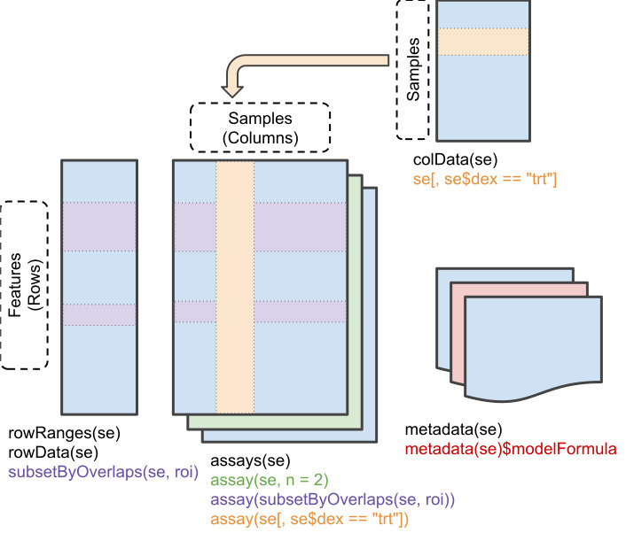

Primera prueba de evaluación continua
================
Jesús Castro Puntero
27 de marzo, 2025

- [1. Abstract](#1-abstract)
- [2. Objetivos](#2-objetivos)
- [3. Métodos](#3-métodos)
- [4. Resultados](#4-resultados)
  - [4.1 Carga del objeto
    `SummarizedExperiment`](#41-carga-del-objeto-summarizedexperiment)
  - [4.2 Análisis de la estructura de
    datos](#42-análisis-de-la-estructura-de-datos)
  - [4.3 Análisis exploratorio inicial de los
    datos](#43-análisis-exploratorio-inicial-de-los-datos)
    - [4.3.1 Imputación de valores
      faltantes](#431-imputación-de-valores-faltantes)
    - [4.3.2 Normalización de los
      datos](#432-normalización-de-los-datos)
    - [4.3.3 Detección de outliers](#433-detección-de-outliers)
    - [4.3.4 Análisis sparse Partial Least Squares Discriminant
      Analysis](#434-análisis-sparse-partial-least-squares-discriminant-analysis)
- [Discusión](#discusión)
- [Conclusiones](#conclusiones)
- [Anexos](#anexos)
  - [Información sobre la sesión de
    R](#información-sobre-la-sesión-de-r)
  - [Referencias](#referencias)

<style type="text/css">
&#10;h1.title {
  font-size: 24px;
  text-align: center;
}
&#10;h3.subtitle {
  font-size: 24px;
  text-align: center;
}
&#10;h4.date { /* Header 4 - and the author and data headers use this too  */
  font-size: 18px;
  text-align: center;
}
&#10;h4.author { /* Header 4 - and the author and data headers use this too  */
    font-size: 18px;
  text-align: center;
}
&#10;</style>

# 1. Abstract

Breve resumen sobre el proceso y los principales resultados. (150
palabras)

# 2. Objetivos

En esta PEC ejecutaremos un análisis exploratorio de los datos del
estudio LC-MS Based Approaches to Investigate Metabolomic Differences in
the Urine of Young Women after Drinking Cranberry Juice or Apple Juice
(ID del estudio: ST000291). Este estudio tiene como objetivo principal
investigar los cambios metabólicos generales inducidos por la ingesta de
concentrados de procianidinas provenientes de zumo de arándanos y zumo
de manzana. Para ello, se utilizó un enfoque metabolómico basado en
cromatografía líquida y espectrometría de masas (LC-MS), que permite una
visión global de los metabolitos presentes en las muestras biológicas
[\[1\]](#ref-a2025_nci). Este trabajo de la Universidad de Florida es un
caso de estudio comparativo o de expresión diferencial ya que su
objetivo es buscar las diferencias entre los perfiles metabólicos
provenientes de los dos tipos de zumo.

Las procianidinas son un grupo importante de moléculas bioactivas
conocidas por sus beneficios para la salud humana, mostrando un gran
potencial en el tratamiento de enfermedades metabólicas crónicas como el
cáncer, la diabetes y las enfermedades cardiovasculares, ya que
previenen el daño celular relacionado con el estrés oxidativo
[\[2\]](#ref-valenciahernandez_2021_procyanidins). Estudios como los de
Y. Liu et al. [\[3\]](#ref-liu_2022_procyanidins) y N. Gonzalez-Abuin et
al. [\[4\]](#ref-gonzalezabuin_2015_procyanidins) apoyan esta idea,
sugiriendo que las procianidinas tienen efectos beneficiosos en la
mejora a la resistencia a la insulina y la regulación de la glucosa, en
parte a través de la modulación de la microbiota intestinal y la
inhibición de vías inflamatorias.

Conocer el comportamiento y la absorción de estas moléculas puede ser de
gran importancia dado su efecto en la salud humana y su amplia
disponibilidad como residuo de productos agro-industriales
[\[2\]](#ref-valenciahernandez_2021_procyanidins). El objetivo de este
documento será realizar una exploración inicial de los datos, enfocada
dentro del proceso de análisis de datos ómicos, adecuando los datos a un
objeto `SummarizedExperiment`, haciendo un pequeño hincapié en el
preprocesamiento de los datos, así como una visualización general de los
mismos. Este análisis exploratorio tiene como meta simular la
preparación de los datos y la confirmación de la adecuación de los
mismos para llevar a cabo análisis más profundos.

Queda fuera del alcance de este documento la identificación de
metabolitos relacionados con las rutas metabólicas derivadas de la
ingesta de los zumos, así como análisis exploratorios más detallados o
la corrección de los posibles errores en la obtención de los datos
crudos.

# 3. Métodos

Para la obtención de las muestras biológicas se reclutaron 18 mujeres
universitarias sanas (21-29 años, IMC 18.5-25) y se aplicó un protocolo
para la obtención de las muestras biológicas. Durante los primeros seis
días, las participantes evitaron alimentos ricos en procianidinas. El
séptimo día, tras un ayuno nocturno, se recogieron muestras basales de
orina. Las participantes fueron asignadas aleatoriamente en dos grupos
(n=9) para consumir zumo de arándano o de manzana durante tres días
(días 7-9). El décimo día, tras un nuevo ayuno nocturno, se recogieron
muestras de orina. Tras un período de lavado de dos semanas, las
participantes cambiaron al otro tipo de zumo y repitieron el protocolo.
Se excluyeron tres participantes del análisis: una por falta de
asistencia y dos por no proporcionar muestras de orina. Cabe destacar
que, aunque en el estudio se menciona la obtención de muestras
biológicas de plasma incluidas dentro de el protocolo, no se publicaron
los datos relativos al análisis de las mismas.

Las muestras biológicas fueron analizadas mediante un enfoque
metabolómico basado en cromatografía líquida acoplada a espectrometría
de masas (LC-MS) para el análisis de los metabolitos. Para la
cromatografía líquida se utilizó el sistema Thermo Scientific-Dionex
Ultimate 3000 con una columna ACE Excel 2 C18-PFP (100 x 2.1mm, 2um).
Para la espectrometría de masas se utilizó el instrumento Thermo Q
Exactive Orbitrap con los modos de ionización positivos y negativos. En
el protocolo de preparación de muestras (Sampleprep ID: SP000319) se
detalla que los datos crudos obtenidos del análisis se convierten a
archivos .MZxml y procesados con MZmine y Metaboanalyst. De esta manera,
el estudio proporciona dos análisis complementarios: el análisis
AN000464 en modo positivo y el análisis AN000465 en modo negativo.

Previo al trabajo de este documento, los nombres de los metabolitos han
sido identificados a través de la herramienta de web scrapping `rvest`
para obtener los identificadores genéricos de PubChem, KEGG y sus
nombres. Los datos, la información de los metabolitos y la información
de las covariables se han almacenado en el archivo ST000291.xlsx. Para
la realización de esta PEC, se usará el archivo ST000291_curated.xlsx
que identifica los datos con el metabolito correspondiente.

Para el posterior análisis, se usarán principalmente el paquete POMA
[\[5\]](#ref-a2025_poma) que nos permitirá construir objetos de
`SummarizedExperiment` y aplicar métodos predefinidos para la
elaboración de análisis y gráficos. También recalcamos la importancia
del paquete metabolomicsWorkbenchR
[\[6\]](#ref-metabolomicsworkbenchr_2025) que nos permite recuperar,
entre otros, la información de los metadatos del análisis original. Al
final del documento se muestra en detalle el conjunto de paquetes usados
para ejecución del código.

# 4. Resultados

## 4.1 Carga del objeto `SummarizedExperiment`

Como se ha comentado en el apartado anterior, para llevar a cabo nuestra
exploración de los datos, utilizaremos principalmente el paquete POMA,
que facilitirá en gran medida la generación de gráficos y estadísticas
de los mismos.

En primer lugar, será necesario cargar los datos del archivo facilitado
‘ST000291curated.xlsx’ y generar un objeto `SummarizedExperiment` para
poder aplicar las funciones destinadas a ese objeto.

Una vez cargados los datos y almacenados en las distintas variables,
podemos utilizar la función de `PomaCreateObject()` para generar el
objeto `SummarizedExperiment` que, al igual que los objetos
`ExpressionSet`, son un tipo de estructura de datos utilizadas en R para
almacenar y manipular datos ómicos y metadatos relacionados. Ambas
pertenecen a diferentes paquetes de Bioconductor, pero mientras
`ExpressionSet` solo permite una matriz de datos en cada objeto,
`SummarizedExperiment` puede tener múltiples matrices, las cuales pueden
ser accedidas a través de `assays()`. Además, el uso de las funciones y
objetos relacionadas con el paquete `SummarizedExperiment`, permite el
uso de muchos otros paquetes más modernos desarrollados con métodos
enfocados con esta estructura de datos. Como veremos a continuación, los
métodos relacionados con el acceso a la información mostrados en la
Figura 1, difieren de los utilizados para los `ExpressionSet`.

<figure>

<figcaption aria-hidden="true">Estructura de datos de un
<code>SummarizedExperiment</code> Morgan M. 2023 <a
href="https://bioconductor.org/packages/release/bioc/vignettes/SummarizedExperiment/inst/doc/SummarizedExperiment.html"
class="uri">https://bioconductor.org/packages/release/bioc/vignettes/SummarizedExperiment/inst/doc/SummarizedExperiment.html</a></figcaption>
</figure>

``` r
# Generamos el objeto SE utilizando la función incluida en
# la librería POMA

# Nótese que tenemos que transponer features para encajar
# con el formato esperado de la función
se <- PomaCreateObject(metadata = target, features = t(features),
    group)
```

A continuación, para obtener los datos acerca del estudio y los
análisis, accederemos a los datos originales disponibles en
www.metabolomicsworkbench.org a través del paquete
`metabolomicsWorkbenchR`. Como el estudio ST000291 contiene dos
análisis, accederemos a cualquiera de ellos para llegar a los metadatos
relativos al experimento. Finalmente, lo añadiremos a nuestro
`SummarizedExperiment`, que contiene los datos de ambos análisis
integrados.

``` r
# Utilizando la librería metabolomicsWorkbenchR previamente
# cargada Generaremos el objeto SE og_se, proviniente del
# análisis original para recuperar los metadatos
og_se = do_query(context = "study", input_item = "study_id",
    input_value = "ST000291", output_item = "SummarizedExperiment")

# Seleccionamos uno de los dos análisis que contiene el
# estudio
og_se1 <- og_se$AN000464

# Configuramos los metadatos de nuestro se, que integra
# ambos análisis del estudio ST000291
metadata(se)$data_source <- metadata(og_se1)$data_source
metadata(se)$study_id <- metadata(og_se1)$study_id
metadata(se)$analysis_id <- "AN000464 and AN000465"
metadata(se)$analysis_summary <- "ESI Negative mode and ESI Negative mode"
metadata(se)$units <- metadata(og_se1)$units
metadata(se)$description <- metadata(og_se1)$description
```

## 4.2 Análisis de la estructura de datos

En primer lugar, nos fijamos en las dimensiones de la matriz de datos
cargada para verificar que el número de muestras es correcto.

``` r
# Dimensiones del SummarizedExperiment
dim(se)
```

    ## [1] 1541   45

Observamos que hemos obtenido 45 muestras ubicadas en las columnas y un
total de 1541 metabolitos identificados en las filas. Las 45 muestras se
corresponden a las muestras obtenidas a las 15 participantes incluidas
en el experimento en cada una de las tres extracciones del protocolo.

A continuación, analizaremos la cantidad de datos faltantes que podría
dificultarnos análisis posteriores.

``` r
# La matriz de datos la encontramos como el primer objeto
# en la lista de assays de nuestro SummarizedExperiment
sum(is.na(assays(se)[[1]]))  # Suma de valores NA
```

    ## [1] 8190

Observamos que, para poder seguir haciendo análisis exploratorios sobre
los datos, tendremos que lidiar con los valores faltantes, cosa que será
abordada más adelante.

Tal y como se ha mencionado más arriba, las funciones para acceder a la
información contenida en el `SummarizedExperiment` son diferentes a las
que usaremos para los objetos `ExpressionSet`. Concretamente,
utilizaremos la función `colData()` para acceder a la información
contenida en las muestras, que forman las columnas de la matriz de
datos. Aquí podremos ver la covariable `Treatment` asociada a cada una
de las muestras biológicas recogidas: “Baseline” para la orina recogida
el séptimo día como muestra de nivel basal, “Apple” para las muestras de
orina tras el período de ingesta de zumo de manzana y “Cranberry” para
las muestras tras el período de ingesta de zumo de arándano.

``` r
# Mostramos las muestras biológicas en cada nivel de
# tratamiento
summary(colData(se)$Treatment)
```

    ##     Apple  Baseline Cranberry 
    ##        15        15        15

Por otro lado, con `rowData()` podremos acceder a la información
relativa a las filas, es decir, a los metabolitos. Aquí, gracias al
trabajo previo de webscrapping mencionado en el apartado de métodos,
tenemos identificado el nombre y el ID de PubChem y de KEGG de cada uno
de los 1541 metabolitos.

``` r
# Mostramos la información cargada de los metabolitos
head(rowData(se))
```

    ## DataFrame with 6 rows and 3 columns
    ##                     names   PubChemID        KEGG
    ##               <character> <character> <character>
    ## V1 10-Deacetyl-2-debenz..      443489      C11899
    ## V2 1,1-Diethyl-2-hydrox..      107754      C13773
    ## V3 1,2-Dihydroxynaphtha..     9543071      C16196
    ## V4 12-trans-Hydroxy juv..    11011465      C16508
    ## V5  14-Dihydroxycornestin     5281160      C08483
    ## V6 1-(5-Phosphoribosyl)..      440341      C04437

Con la función `metadata()` podemos acceder a la información relativa al
estudio previamente cargada, como el origen de los datos o las unidades:

``` r
metadata(se)$data_source
```

    ## [1] "Metabolomics Workbench"

``` r
metadata(se)$units
```

    ## [1] "Peak area"

## 4.3 Análisis exploratorio inicial de los datos

El análisis de estudios ómicos suele estar caracterizado por una alta
dimensionalidad en los datos, lo que puede dificultar la comprensión a
través de resúmenes estadísticos donde se muestren todos los componentes
de cada muestra. Para proceder, en primer lugar deberemos eliminar la
presencia de errores faltantes ya que puede comprometr la calidad de las
métricas estadísticas o inutilizar el uso de muchas funciones.

### 4.3.1 Imputación de valores faltantes

Para llevar a cabo la imputación de valores en lugares de la matriz de
datos con valores faltantes, usaremos a cabo la función `PomaImute` de
la librería `POMA`. A través de los parámetros de opciones del método,
podemos elegir que no trate a los 0 como valores faltantes, ya que
simplemente indican el valor obtenido para ese metabólito en la muestra
biológica y que sí que elimine aquellas filas con un exceso de valores
faltantes, siendo en este caso el límite un 20% de los datos. Dado que
nuestros datos están agrupados, cada muestra biológica perteneciendo a
un tipo de tratamiento, y disponemos de muchos metabolitos, podemos
parametrizar que elimine la fila entera para todos los grupos.
Finalmente, el método especificado para la imputación de valores será el
algoritmo k-Nearest Neighbours, que estimará los valores faltantes en
función de los valores vecinos más cercanos.

``` r
# Curamos los datos de nuestro SE mediante la función PomaImpute
imp_se <- se %>%PomaImpute(zeros_as_na = FALSE, # Los 0 no son NA
                remove_na = TRUE, # Eliminamos features con más de un/ 
                cutoff = 20, #      /20% de valores perdidos (cutoff)
                group_by = TRUE, 
                method = "knn") # Imputamos a los valores perdidos según                                   el algoritmo de knn
```

    ## 182 features removed.

Con la previa imputación hemos eliminado un total de 182 metabolitos,
reduciendo las dimensiones de nuestra matriz de datos.

### 4.3.2 Normalización de los datos

A continuación y siguiendo el workflow típico de un análisis utilizando
las funciones del paquete `POMA`, normalizaremos los datos y
observaremos como afecta esto a los mismos. Observamos que podemos
conseguir una normalización de los datos con una transformación del
logaritmo natural de Pareto. Finalmente, compararemos gráficamente con
un diagrama de caja las distribuciones de los tres grupos antes y
después de la normalización.

``` r
# Generamos la variable con los datos normalizados
norm_se <- imp_se %>%
    PomaNorm(method = "log_pareto")

# Y comparamos gráficamente como son los datos antes y
# después de la normalización
p1 <- PomaBoxplots(imp_se, x = "samples", theme_params = list(axistext = "y"))
p2 <- PomaBoxplots(norm_se, x = "samples", theme_params = list(legend_title = FALSE,
    axistext = "y", axistitle = "X"))

# Imprimimos ambos gráficos juntos usando el paquete
# patchwork
p1 + p2
```


De los gráficos anteriores observamos, antes de la normalización, que
para la mayoría de metabolitos los niveles detectados son 0 o muy bajos,
y sólo algunos metabolitos obtienen valores de área elevados como
resultado del análisis. Estos metabolitos podrían estar relacionados con
nuestro objeto de interés. Por otro lado, tras la normalización,
observamos que aunque las distribuciones son relativamente similares y
aproximadamente normales a simple vista, parece haber bastante varianza
intragrupal.

### 4.3.3 Detección de outliers

La identificación y eliminación de outliers es un punto importante en el
análisis estadístico ya que puede afectar a los resultados. No obstante,
también pueden aportar información clave si estos provienen de
información genuina y no de un error de medición o de procedimiento.
Para la identificación y eliminación de outliers, encontramos la función
`PomaOutliers` que nos permitirá escoger el tipo de método de medición
de distancia del outlier y el tipo de medida central. También
establecemos el valor de corte por defecto.

``` r
outlier_results <- imp_se %>%
    PomaOutliers(method = "euclidean", type = "median", coef = 2,
        labels = FALSE)

outlier_results$outliers
```

    ## # A tibble: 1 × 4
    ##   sample groups distance_to_centroid limit_distance
    ##   <chr>  <fct>                 <dbl>          <dbl>
    ## 1 a12    Apple          15917686960.   14376816373.

Observamos que, para los datos sin normalizar, la función detecta que la
muestra a12 pertenciente al grupo del tratamiento tras la ingesta de
zumo de manzana es un outlier. Podemos acceder al nuevo
`SummarizedExperiment` con la matriz de datos sin esta muestra.
Observaremos que tras la operación de imputación y la eliminación de
outliers hemos reducido las dimensiones de nuestra matriz de datos,
habiendo eliminado 182 metaboltos y 1 muestra.

``` r
clean_se <- outlier_results$data
dim(clean_se)
```

    ## [1] 1359   44

### 4.3.4 Análisis sparse Partial Least Squares Discriminant Analysis

Como se ha comentado al comienzo del apartado 4.3, una manera de poder
analizar datos con miles de variables, como es el caso de estos datos
metabolómicos, es a través de la reducción de la dimensionalidad. A
través de la técnica sparse PArtial Least Squares Discriminant Analysis
(sPLS-DA) podemos ejecutar la elección de variables, con costes
computacionales competitivos y resultados gráficos interpretables
{[\[7\]](#ref-le_cao_boitard_besse_2011)}.

En el paquete `POMA` tenemos funciones que nos ayudan a realizar este
análisis.

``` r
poma_splsda <- clean_se %>%
    PomaPLS(method = "splsda", y = "Treatment", ncomp = 5, labels = FALSE,
        ellipse = FALSE)

# Función pull() para pasar a vector Fuente:
# https://stackoverflow.com/questions/21618423/extract-a-dplyr-tbl-column-as-a-vector

vec_features <- pull(poma_splsda$selected_features[, 1])
vec_info <- rowData(se)[vec_features, 1]
vec_info -> poma_splsda$selected_features[, 3]
names(poma_splsda$selected_features)[3] <- "Metabolito"

kable(poma_splsda$selected_features, caption = "Features seleccionadas")
```

| feature |      value | Metabolito                  |
|:--------|-----------:|:----------------------------|
| V308    | -0.7333580 | 12-Hydroxydodecanoic acid_1 |
| V1236   |  0.4107719 | (R)-Mevalonate_1            |
| V766    |  0.2975272 | Digitalose                  |
| V639    | -0.2913641 | Butanoic acid_1             |
| V1011   | -0.2447678 | Methyl farnesoate_1         |
| V762    | -0.1757723 | Diethylene glycol_1         |
| V457    |  0.1354120 | 4-Hydroxybutanoic acid_1    |
| V813    |  0.0802793 | epsilon-Caprolactam         |
| V173    | -0.0652055 | Hypoglycin B                |
| V464    | -0.0140313 | 4-Isopropylbenzaldehyde     |

Features seleccionadas

``` r
poma_splsda$factors_plot
```


Del análisis anterior observamos cómo, tras la selección de variables,
las muestras biológicas posteriores a la ingesta de zumo de manzana
según el protocolo establecido, presenta unas puntuaciones
diferenciadamente mayores que las obtenidas con zumo de arándano y las
muestras basales. Observando los metabolitos seleccionados para el
cálculo del componente 1, vemos que esta información se traduce
principalmente, en menor presencia de ácido 12-hidroxidodecanoico y
mayor presencia de (R)-Mevalonato.

# Discusión

-\> Falta muestras de sangre -\> n demsaiado pequeña -\> Está bien que
sea un experimento cruzado

Es posible viendo los resultados que no haya diferencias significativas
y haya que hacer análisis más profundos.

Es importante que reflexionéis sobre las limitaciones del estudio y
sobre el trabajo que habéis realizado, en el contexto del problema
biológico de interés que aborda la PEC. (1 página)

rangedexperiments con importantes

# Conclusiones

De tener pistas que nos lleven a que estos alimentos absorben muchas
procianidinas, igual es interesante aumentar n, concluir que realmente
se absorbe en general e investigar que rutas metabolicas dan lugar a
esto.

# Anexos

## Información sobre la sesión de R

``` r
# Mostramos la información de la sesión
print(sessionInfo(), locale = FALSE)
```

    ## R version 4.4.3 (2025-02-28 ucrt)
    ## Platform: x86_64-w64-mingw32/x64
    ## Running under: Windows 10 x64 (build 19045)
    ## 
    ## Matrix products: default
    ## 
    ## 
    ## attached base packages:
    ## [1] stats4    stats     graphics  grDevices utils    
    ## [6] datasets  methods   base     
    ## 
    ## other attached packages:
    ##  [1] knitr_1.50                   
    ##  [2] dplyr_1.1.4                  
    ##  [3] POMA_1.16.0                  
    ##  [4] readxl_1.4.5                 
    ##  [5] SummarizedExperiment_1.36.0  
    ##  [6] Biobase_2.66.0               
    ##  [7] GenomicRanges_1.58.0         
    ##  [8] GenomeInfoDb_1.42.3          
    ##  [9] IRanges_2.40.1               
    ## [10] S4Vectors_0.44.0             
    ## [11] BiocGenerics_0.52.0          
    ## [12] MatrixGenerics_1.18.1        
    ## [13] matrixStats_1.5.0            
    ## [14] patchwork_1.3.0              
    ## [15] ggplot2_3.5.1                
    ## [16] metabolomicsWorkbenchR_1.16.0
    ## 
    ## loaded via a namespace (and not attached):
    ##  [1] tidyselect_1.2.1            viridisLite_0.4.2          
    ##  [3] farver_2.1.2                fastmap_1.2.0              
    ##  [5] digest_0.6.37               lifecycle_1.0.4            
    ##  [7] cluster_2.1.8.1             magrittr_2.0.3             
    ##  [9] compiler_4.4.3              rlang_1.1.5                
    ## [11] tools_4.4.3                 igraph_2.1.4               
    ## [13] utf8_1.2.4                  yaml_2.3.10                
    ## [15] data.table_1.17.0           rARPACK_0.11-0             
    ## [17] S4Arrays_1.6.0              labeling_0.4.3             
    ## [19] ontologyIndex_2.12          curl_6.2.1                 
    ## [21] DelayedArray_0.32.0         plyr_1.8.9                 
    ## [23] RColorBrewer_1.1-3          xml2_1.3.8                 
    ## [25] BiocParallel_1.40.0         abind_1.4-8                
    ## [27] withr_3.0.2                 purrr_1.0.4                
    ## [29] grid_4.4.3                  colorspace_2.1-1           
    ## [31] scales_1.3.0                MASS_7.3-65                
    ## [33] MultiAssayExperiment_1.32.0 ellipse_0.5.0              
    ## [35] cli_3.6.4                   rmarkdown_2.29             
    ## [37] vegan_2.6-10                crayon_1.5.3               
    ## [39] generics_0.1.3              RSpectra_0.16-2            
    ## [41] rstudioapi_0.17.1           reshape2_1.4.4             
    ## [43] httr_1.4.7                  stringr_1.5.1              
    ## [45] zlibbioc_1.52.0             splines_4.4.3              
    ## [47] parallel_4.4.3              impute_1.80.0              
    ## [49] formatR_1.14                cellranger_1.1.0           
    ## [51] XVector_0.46.0              vctrs_0.6.5                
    ## [53] Matrix_1.7-3                jsonlite_1.9.1             
    ## [55] ggrepel_0.9.6               tidyr_1.3.1                
    ## [57] glue_1.8.0                  codetools_0.2-20           
    ## [59] mixOmics_6.30.0             ggtext_0.1.2               
    ## [61] stringi_1.8.4               gtable_0.3.6               
    ## [63] UCSC.utils_1.2.0            munsell_0.5.1              
    ## [65] tibble_3.2.1                pillar_1.10.1              
    ## [67] htmltools_0.5.8.1           GenomeInfoDbData_1.2.13    
    ## [69] R6_2.6.1                    struct_1.18.0              
    ## [71] evaluate_1.0.3              lattice_0.22-6             
    ## [73] gridtext_0.1.5              corpcor_1.6.10             
    ## [75] Rcpp_1.0.14                 gridExtra_2.3              
    ## [77] SparseArray_1.6.2           nlme_3.1-167               
    ## [79] permute_0.9-7               mgcv_1.9-1                 
    ## [81] xfun_0.51                   pkgconfig_2.0.3

## Referencias

Aquí debéis incluir un enlace al repositorio de GitHub que contiene el
código que habéis utilizado para abordar el análisis (debidamente
comentado).

<https://www.metabolomicsworkbench.org/data/DRCCMetadata.php?Mode=Study&StudyID=ST000291>

<div id="refs" class="references csl-bib-body" entry-spacing="0">

<div id="ref-a2025_nci" class="csl-entry">

<span class="csl-left-margin">\[1\]
</span><span class="csl-right-inline">“NCI dictionary of cancer terms.”
Cancer.gov, 2025. Accessed: Mar. 24, 2025. \[Online\]. Available:
<https://www.cancer.gov/publications/dictionaries/cancer-terms/def/lc-ms></span>

</div>

<div id="ref-valenciahernandez_2021_procyanidins" class="csl-entry">

<span class="csl-left-margin">\[2\]
</span><span class="csl-right-inline">L. J. Valencia-Hernandez, J. E.
Wong-Paz, J. A. Ascacio-Valdés, M. L. Chávez-González, J. C.
Contreras-Esquivel, and C. N. Aguilar, “Procyanidins: From
agro-industrial waste to food as bioactive molecules,” *Foods*, vol. 10,
p. 3152, Dec. 2021, doi:
[10.3390/foods10123152](https://doi.org/10.3390/foods10123152).</span>

</div>

<div id="ref-liu_2022_procyanidins" class="csl-entry">

<span class="csl-left-margin">\[3\]
</span><span class="csl-right-inline">Y. Liu *et al.*, “Procyanidins and
its metabolites by gut microbiome improves insulin resistance in
gestational diabetes mellitus mice model via regulating NF-kB and NLRP3
inflammasome pathway,” *Biomedicine & Pharmacotherapy*, vol. 151, p.
113078, Jul. 2022, doi:
[10.1016/j.biopha.2022.113078](https://doi.org/10.1016/j.biopha.2022.113078).</span>

</div>

<div id="ref-gonzalezabuin_2015_procyanidins" class="csl-entry">

<span class="csl-left-margin">\[4\]
</span><span class="csl-right-inline">N. Gonzalez-Abuin, M. Pinent, A.
Casanova-Marti, L. Arola, M. Blay, and A. Ardevol, “Procyanidins and
their healthy protective effects against type 2 diabetes,” *Current
Medicinal Chemistry*, vol. 22, pp. 39–50, 2015, doi:
[10.2174/0929867321666140916115519](https://doi.org/10.2174/0929867321666140916115519).</span>

</div>

<div id="ref-a2025_poma" class="csl-entry">

<span class="csl-left-margin">\[5\]
</span><span class="csl-right-inline">“POMA,” *Bioconductor*, 2025, doi:
[10.1371/journal.pcbi.1009148\>](https://doi.org/10.1371/journal.pcbi.1009148>).</span>

</div>

<div id="ref-metabolomicsworkbenchr_2025" class="csl-entry">

<span class="csl-left-margin">\[6\]
</span><span class="csl-right-inline">*Bioconductor*. 2025. Available:
<https://www.bioconductor.org/packages/release/bioc/html/metabolomicsWorkbenchR.html></span>

</div>

<div id="ref-le_cao_boitard_besse_2011" class="csl-entry">

<span class="csl-left-margin">\[7\]
</span><span class="csl-right-inline">K.-A. Lê Cao, S. Boitard, and P.
Besse, “Sparse PLS discriminant analysis: Biologically relevant feature
selection and graphical displays for multiclass problems,” *BMC
Bioinformatics*, vol. 12, no. 1, Jun. 2011, doi:
<https://doi.org/10.1186/1471-2105-12-253>.</span>

</div>

</div>
